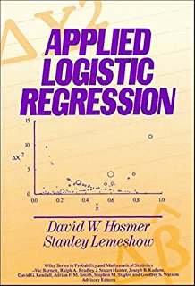
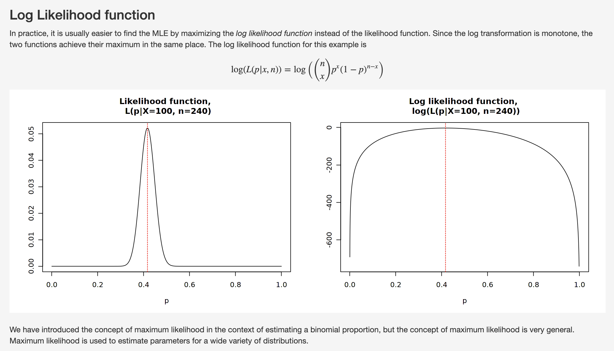

class: inverse, left, middle

# Logistic regression and generalized linear models 

.pull-left[
Nicholas G Reich <br>
Professor of Biostatistics<br>
BIOSTATS 690P: Topics in Health Data Science<br>
Spring 2023
]
<!---->
.pull-right[]

```{r xaringan-themer, include=FALSE, warning=FALSE}
library(xaringanthemer)
style_mono_accent(
  base_color = "#881C1C"
)
```

```{r, echo=FALSE}
library(tidyverse)
theme_set(theme_bw())
```

---

# Beyond linear regression
Drawing a line through data can be simple and powerful. 

.center[
$$Y = X\beta + \epsilon $$ 

```{r, fig.height=6, fig.width=6, echo=FALSE, message=FALSE, warning=FALSE}
x <- runif(100)
y <- 2 + 5*x + rnorm(100)
qplot(x, y, geom=c("point", "smooth"), xlab = element_blank(), ylab = element_blank(), method="lm", se=FALSE)
```
]


---

# Sometimes, the data demand more 
.pull-left[
```{r, fig.height=6, fig.width=6, echo=FALSE, message=FALSE, warning=FALSE}
x <- runif(100, -3, 3)
y <- as.numeric(purrr::rbernoulli(n=100, p=boot::inv.logit(2 + 3*x)))
ggplot(tibble(x=x, y=y), aes(x, y)) +
  geom_point() +
  geom_smooth(method="lm", se=FALSE) +
  xlab(NULL) + ylab(NULL) + 
  annotate("text", x=0, y=.5, label="X", size=30, color="red")
```
]

.pull-right[
```{r, fig.height=6, fig.width=6, echo=FALSE, message=FALSE, warning=FALSE}
ggplot(tibble(x=x, y=y), aes(x, y)) +
  geom_point() +
  geom_smooth(method="glm", se=FALSE, method.args = list(family="binomial")) +
  xlab(NULL) + ylab(NULL)
```
]


---
class: inverse, center, middle

# The Women's Health and Aging Study


---

# The Women's Health and Aging Study
Example is adapted from my work as an RA on this project back in 2007-2008.

.pull-left[
 - WHAS was a **population-based prospective cohort of women age 65 and older** designed to sample the one-third most-disabled women in a twelve zip code area of Baltimore, Maryland (Guralnik J, 1995). 
 - Broadly, WHAS was designed to identify and answer questions about **risk factors for older women becoming frail**. 
 - This study was conducted in the 1990s and 2000s. 
 
Participants were defined as frail if they met three or more of five clinical criteria and not frail otherwise.
 ]
 
.pull-right[ .center[


👆 One of many papers from the WHAS team...<br> 
<a href="https://doi.org/10.1016/0895-4356(96)00231-4">link to paper</a>

]
]
 
---

# Getting set up with WHAS data

```{r, message=FALSE, warning=FALSE}
library(tidyverse)
dat <- read_csv("../../data/whas.csv") |> 
  mutate(
    ed_cat = case_when( ## make a new categorical education variable
      SCRPTED2 <= 8  ~ "No HS",
      SCRPTED2 <= 11 ~ "Some HS",
      SCRPTED2 == 12 ~ "HS Grad",
      SCRPTED2 >  12 ~ "Some college"
    ),
    ed_cat = reorder(ed_cat, SCRPTED2), ## reorder factor levels
    frail_status = ifelse(bin.frail == 1, "frail", "not frail"), ## frailty labels
    race = relevel(factor(ifelse(race == 1, "white", "black")), "white") ## race labels
  )
select(dat, bin.frail, frail_status, race, SCRPTAGE, SCRMMSET, ed_cat)
```


---
# Demographics of the WHAS cohort

We will study a subpopulation of 682 women.

```{r, include=FALSE}
dat |> 
  select(frail_status, race, ed_cat) |> 
  GGally::ggpairs()
```


```{r}
table(dat$frail_status)
table(dat$race) 
table(dat$ed_cat)
```


---
class: inverse, center, middle

# Logistic Regression

---
# What are "odds"?


Odds are another way of quantifying the probability of an event, commonly used in gambling.

For some event $D$,
$$\text{odds}(D) = \frac{P(D)}{P(\text{not } D)} = \frac{P(D)}{1-P(D)}$$

and

$$\text{P}(D) = \frac{odds(D)}{1+odds(D)}$$

Similarly, if we are told the "odds of $D$ are $x$ to $y$" then
$$\text{odds}(D) = \frac{x}{y} = \frac{x/(x+y)}{y/(x+y)}$$

which implies

$$P(D) = x/(x+y),\quad P(\text{not }D) = y/(x+y)$$


---

# Odds Ratios

For some outcome of interest (say, disease or $D$) in two groups, (e.g. $Y$, with values exposed and unexposed), we could write the odds of Disease given a particular exposure as

$$odds_{\text{exposed}}(D) = \frac{P(D | Y=\text{exposed})}{1-P(D | Y=\text{exposed})}$$

**Odds Ratios (ORs) compare the odds of an event in two different groups**. 
Therefore, the odds ratio comparing exposed to unexposed is
$$OR_{\text{exp v unexp}} = \frac{odds_{\text{exposed}}}{odds_{\text{unexposed}}}$$

$$OR = \frac{P(\text{disease} | \text{exposed}) / [1-P(\text{disease} | \text{exposed})]}{P(\text{disease} | \text{unexposed})/[1-P(\text{disease} | \text{unexposed})]} $$

If the OR were equal to 1.3, say, one interpretation could be:<br> *"the odds of disease among the exposed population is 30% higher than in the unexposed population."*


---

# Odds Ratios (continued)

$$OR_{\text{exp v unexp}} = \frac{odds_{\text{exposed}}}{odds_{\text{unexposed}}}$$

$$OR = \frac{P(\text{disease} | \text{exposed}) / [1-P(\text{disease} | \text{exposed})]}{P(\text{disease} | \text{unexposed})/[1-P(\text{disease} | \text{unexposed})]} $$


#### Facts about Odds Ratios
  - ORs have range of (0, $\infty$). 
  - OR = 1 means no difference between the groups.
  - They have a multiplicative scale: e.g. OR = 0.5 and OR = 2 both indicate that one group has twice the odds of another.
  - This means that the log OR is on an additive scale of odds (This is important for logistic regression!).
  - OR is not a ratio of probabilities.


---
# Looking at the association of race with frailty

Comparing the odds of frailty in black and white elderly women, using WHAS data.

$$OR_{\text{black v white}}(\text{frailty}) = \frac{odds_{\text{b}}(\text{frailty})}{odds_{\text{w}}(\text{frailty})}$$

--

```{r}
or <- epitools::oddsratio(with(dat, table(race, frail_status)), rev="columns")
```

.pull-left[
```{r}
or$data
## raw OR calculation
(28/116) / (69/469)
```
]

--

.pull-right[
```{r}
round(or$measure, 3)
round(or$p.value, 3)
```
]


---

# ORs via logistic regression

Logistic regression:

$$ \text{logit } P(\text{frailty}|R) = \log odds(\text{frailty}|R) = \log \frac{P(\text{frailty}|R)}{1-P(\text{frailty}|R)} = \beta_0 + \beta_1 \cdot R$$
where $R$ is defined to be 1 if race == "black" and 0 otherwise.

$$\text{logit } P(\text{frailty} | R) = \beta_0 + \beta_1 \cdot R$$
--
This simple model says, "if R=1, then the log odds are $\beta_0+\beta_1$"
$$\text{logit } P(\text{frailty} | R=1) = \beta_0 + \beta_1$$
--
and "if R=0, then the log odds are $\beta_0$"
$$\text{logit } P(\text{frailty}|R) = \beta_0 + \beta_1\cdot 0 = \beta_0$$


---

# Why log-odds?

On a previous slide we saw that logistic regression tends to have the form like:
$$\text{logit } P(\text{frailty}|R) = \log odds(\text{frailty}|R) = \log \frac{P(\text{frailty}|R)}{1-P(\text{frailty}|R)} = \beta_0 + \beta_1\cdot R$$

### Why do we need the log-odds transformation on the left hand side?
- Probabilities range from 0 to 1
- Log-probabilities range from $-\infty$ to 0
- Odds range from 0 to $\infty$.
- Log-odds range from $-\infty$ to $\infty$.
- To best estimate those $\beta$ parameters on the right hand side of the equation, we want the left-hand side to be as flexible as possible.


---

# ORs for the real data

```{r}
round(or$measure, 3)
```

```{r}
m1 <- glm(bin.frail ~ race, data=dat, family="binomial")
exp(coef(m1)) ## need to exponentiate log ORs to get interpretable ORs #<<
```

### Possible interpretations

*"Black women are estimated to have 64% higher odds of frailty than white women."*
<br>
or
<br>
*"The odds of frailty in black women are 1.64 times that in white women."*

---

# From logistic regression to odds ratios

The general model is expressed as: 
$$\log odds (\text{frailty} | R)  = \log \frac{P(\text{frailty}|R)}{1-P(\text{frailty}|R)} = \beta_0 + \beta_1\cdot R$$

--

By substituting in values of R, it then follows that:
$$\log odds (\text{frailty} | R=1)  = \beta_0 + \beta_1$$
$$\log odds (\text{frailty} | R=0)  = \beta_0$$

--

And by subtracting the two lines above, we have that:
$$ \log odds (\text{frailty} | R=1) - \log odds (\text{frailty} | R=0) =  \beta_1 $$
$$ \log \frac{odds (\text{frailty} | R=1)}{odds (\text{frailty} | R=0)} =  \beta_1$$


---

# But life is more complicated than a 2x2 table

What happens when we want to include more variables, including those that aren't just binary or categorical?

.center[
```{r, echo=FALSE, message=FALSE, warning=FALSE, fig.width=8, fig.height=4}
ggplot(dat, aes(x=SCRMMSET, y=bin.frail)) + 
  geom_jitter(width=.1, height=.05) + 
  geom_smooth(method="glm", method.args = list(family="binomial")) + 
  facet_grid(race~ed_cat) + ylab("frail") + xlab("Score on Mini-Mental exam")
```
]

The nice thing about logistic regression is that we can add more variables, as in linear regression.

$$\text{logit } P(\text{frailty}_i | R_i)  = \beta_0 + \beta_1\cdot R_i + \beta_2\cdot M_i + \beta_3 \cdot E_i$$

where $M_i$ stands for the $i^{th}$ woman's score on the MiniMental exam (higher scores indicate stronger cognition) and $E_i$ the number of grades completed in school.


---

# Interpretation of logistic regression

```{r}
m2 <- glm(bin.frail ~ race + ed_cat + SCRPTAGE, data=dat, family="binomial")
```

.pull-left[
Raw model coefficients for race-only model
```{r}
round(summary(m1)$coef, 3) 
```
]

.pull-right[
Raw model coefficients adding education, age
```{r}
round(summary(m2)$coef, 3)
```
]

--

**Interpretation** <br>
*"Adjusting for race and age, having completed more education was associated with lower levels of frailty. Women having completed some college had 82% (OR = $e^{-1.708} = 0.181$) lower odds of frailty than women of the same race and age who did not attend high school."*

---

# Cautionary tale about using race a predictor

Using "race" as a covariate in models is complicated, and more often than not should be avoided. Some quotes from Iyer et al (2022) [1, emphasis added]

 > "Self-identified race/ethnicity is **a correlate** of both genetic ancestry and socioeconomic factors..."
 
 > "Race/ethnicity is increasingly understood as **a multidimensional construct** that reflects both how the individual perceives themselves as well as how they are perceived by others"

 > "Both biomedical and social scientists acknowledge that **relying on ... perceived race/ethnicity to infer causality** is problematic due to its high correlation with several interrelated biologic and non-biologic pathways that drive disparities."

Therefore, when possible, it is preferable to adjust for either measurable genetic traits or measurable socioeconomic factors in your models.

.footnote[
[1] Iyer HS, Gomez SL, Cheng I, Rebbeck TR (2022) Relative impact of genetic ancestry and neighborhood socioeconomic status on all-cause mortality in self-identified African Americans. PLoS ONE 17(8): e0273735. https://doi.org/10.1371/journal.pone.0273735
]

---
class: inverse, center, middle

# Generalized Linear Models

---

# A brief history of GLMs

.pull-left[
- Early versions of GLMs were used in the 1920s by Ronald Fisher, an important foundational figure in early statistics. (Also someone who believed in eugenics, and had controversial [views on race](https://en.wikipedia.org/wiki/Ronald_Fisher#Views_on_race).)
- Unified theory around GLMs were developed in 1970s-1980s
- The most-cited statistics book in print is Hosmer and Lemeshow's "Applied Logistic Regression" (1989 1st ed., 2013 3rd ed.) with over 50,000 citations, written by two UMass professors. 
- Good at describing relationships and associations, interpretable.
- Predictions: GLMs are an "outdated" way to make predictions, more popular models tend to be nonparametric, require fewer assumptions.
]

.pull-right[.center[]]

---

# The general view

For some general (not necessarily Gaussian, continuous) random variable $Y$, we are interested in modeling its mean, or expected value, as a function of other variables. For a particular observation $i$, we can define:
$$\mu_i = E[Y_i|X_i]$$

And then we want to transform that mean into a more convenient (i.e., continuous, ideally unbounded) scale using a "link" function $g(\cdot)$. So we have: [1]
$$g(\mu_i) = X_i\beta $$

For example, in logistic regression, where $Y_i$ is a Bernoulli random variable (0 or 1), we take $g(\cdot)$ to be the log-odds, or "logit" function:
$$g(\mu_i) = \text{logit}(E[Y_i|X_i]) = \text{logit}(P[Y_i = 1|X_i])  = X_i\beta $$


.footnote[
[1] Note that here we are using the vector notation to represent an expression that earlier in the slides we wrote out individually $X_i\beta  = \beta_0 + \beta_1\cdot X + \dots$. For specific examples, it can be nice to write out the model terms exactly, but for a more general case it is easier and more convenient to write the product of two vectors.
]
 
---

# Natural link function choices

There are mathematical reasons to prefer one kind of link function over another, and it depends on the variation and structure of the response variable $Y$. 

If $Y$ is assumed to follow a distribution from the exponential family, then its probability density function can be written as:
$$f(y|\theta) = a(\theta)b(y)\exp\{y \cdot Q(\theta)\}$$

- $a(\theta)$ is some function of the parameters 
- $b(y)$ is some function of the data
- $Q(\theta)$ is the **natural parameter**, which implies a "canonical" link function for the model


---

# The natural parameters for Logistic Regression

For binary outcome data
- $Pr(Y_i = 1) = \pi_i = E(Y_i|X_i)$
- $f(y_i|\theta_i) = \pi_i^{y_i}(1-\pi_i)^{1-y_i} = (1-\pi_i)\Big(\frac{\pi_i}{1-\pi_i}\Big)^{y_i} = (1-\pi_i)\exp\Big\{y_i\log\frac{\pi_i}{1-\pi_i}\Big\}$
- where:
    * $\theta = \pi_i$
    * $a(\pi_i) = 1-\pi_i$
    * $b(y_i) = 1$
    * $Q(\pi_i) = \log\Big(\frac{\pi_i}{1-\pi_i}\Big)$
- The natural parameter $Q(\pi_i)$ implies the canonical link function: $\text{logit}(\pi) = \log\Big(\frac{\pi_i}{1-\pi_i}\Big)$

---

# Logistic Regression, the likelihood

For one observation, the likelihood is:
$$ f(y_i|\pi_i) = \pi_i^{y_i}(1-\pi_i)^{1-y_i}$$

For multiple, assumed independent observations, the likelihood is
$$f(y|\pi) = \prod_{i=1}^N \pi_i^{y_i}(1-\pi_i)^{1-y_i}$$

But it's always easier to work with log-likelihoods
$$\ell(y|\pi) = \log f(y|\pi) =  \sum_{i=1}^N y_i\log \pi_i + (1-y_i)\log (1-\pi_i)$$

Note that here, $\pi_i = \frac{e^{X_i\beta}}{1 + e^{X_i\beta}}$.


---

# Exploring a simple binomial likelihood

.center[
http://shiny.calpoly.sh/MLE_Binomial/


]


---

# Key points to understand about likelihood

 - The likelihood encodes information about **our best estimate** about parameter values given the data: the Maximum Likelihood Estimate (MLE).
 - **The uncertainty in the estimates** is mathematically represented in the curvature of the likelihood surface. The more peaked, the more certain we are, the lower the variance estimates are.
 - In general, **there is not a closed-form mathematical solution** to find the MLE or the variance for a GLM, but there are fast algorithms to do it.
- Statistical software helps us this by iteratively refining estimates of parameters until convergence is achieved.
 - **Bayesian statistics** uses other computational methods to similarly find regions of the parameter space that are more consistent with the data, using the likelihood. (More on this near the end of the semester.)

