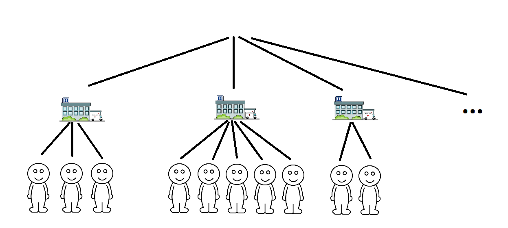
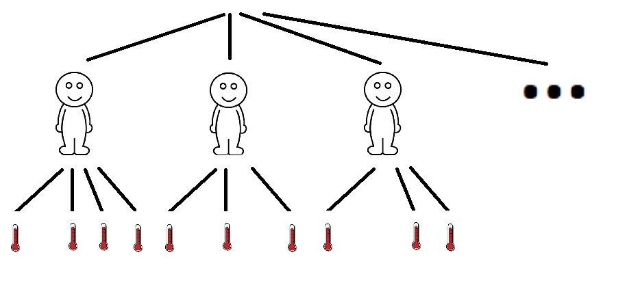
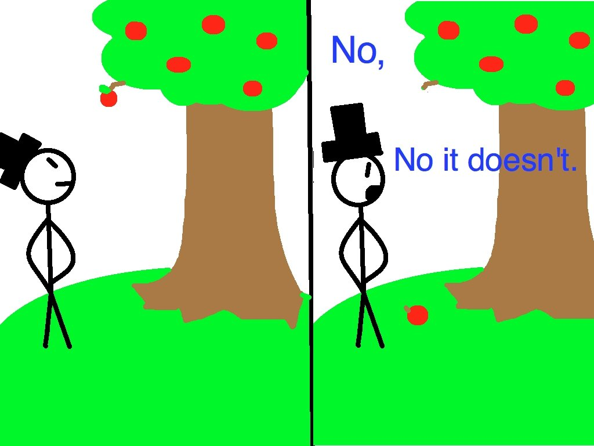
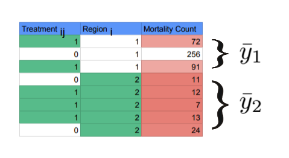
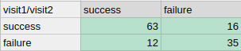
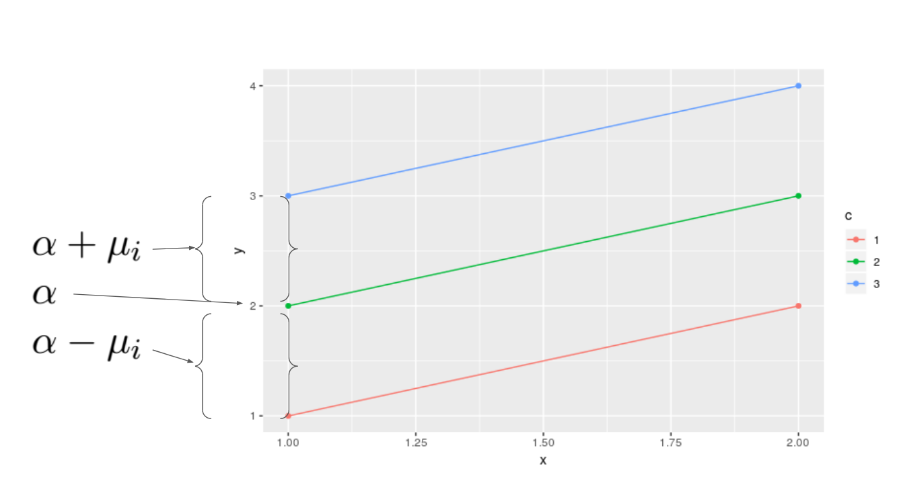

```{r setup, include=FALSE}
knitr::opts_chunk$set(echo = TRUE)
```


Clustered Data
========================================================
-
\textbf{Clustered Data:}    
- Hierarchy of nested populations    
- Longitudinal, Correlated observations or sets
-
\textbf{Example: (Hierarchy of nested populations)}     
- Patient $\in$ Hospital $\in$ Region



Clustered Data
========================================================

-
\textbf{Example: (Longitudinal)}
- Repeated measurements on the same unit of observation
\begin{itemize}
\tiny
\item Patients have multiple temperature measurements over time
\item Temperature $\in$ Patient $\in$ Clinic
\end{itemize}




Implications of Clustered Data
========================================================
- Observations in clusters violates our assumptions of independence
- Clustered data are less informative and less generalizable than independent data
- \textbf{Example:} Subjects within a household are more similar and will vary less. Similar genetics and behavior



Example Notation
========================================================
Mixed models, also known as multilevel or hierarchical models, are used to model cluster data. We will use the following notation to model such data.

$Y_{ij} =$ Response variable

$Trt_{ij} =$ Treatment variable


Example Notation 2
========================================================

$$j = 1,~2,~...,~n$$
$$i = 1,~2,~...,~n_i$$
$$N = \sum_i n_i= \text{total number of groups}$$
$$Treatment ~~Trt_{ij} = \begin{cases} 1, & \mbox{if $Trt_{ij}$ was treated} \\ 0, & \mbox{otherwise } \end{cases}$$

{width=375px}

Example to begin with
========================================================
- Let $Y_{ij}$ denotes the counts of mortality
$$Y_{ij} \sim Poisson(\lambda_{ij},P_{i})$$
$$log(\lambda_{ij}) = \beta_0 + \beta_1Trt_{ij} + \beta_2X_i$$

- We want to make inference about $\beta_1$.  What is the treatment effect?  
- Observations are not iid, need "adjustment"
- How can we account for variance within groups?
\small
\begin{itemize}
\item 1. Marginal models with generalized estimating equations (GEE) for variance adjustment 
\item 2. generalized linear mixed models (GLMM's)
\end{itemize}


GLMM's Models
========================================================
- Account for modeling for individual and group level variation in estimating group-level coefficients
- Allow the proper measure of variation in individual level regression coefficients
- For point estimates, Shrinkage (relative to sample size) of parameters toward group means
- Rule of thumb
\small
\begin{itemize}
\item number of groups greater than 5
\item substainial variation among groups
\end{itemize}


GLMMS Model Notation
========================================================

- where $\beta$ is a fixed effect and $\mu_i$ are varying (random) effects
$$
\begin{aligned}
g(E[y_{ij}|\mu_i]) = X^T_{ij}\beta + Z^T_{ij}\mu_i \\
\mu_{i} \sim N(0, G_\theta)
\end{aligned}
$$

- Agresti uses *i* to represent the group, $Y_{ij}$ is the $jth$ observation in $ith$ group
- So here we have *i* different $\mu$ which are draws from a normal
- The $\mu_i$ have a common distribution
- Notice $\beta$ has no subscript, $\beta$ is fixed
- $\beta$ is a global estimate and $\mu_i$ is a group specific estimate
- $g$ is a glm link
- $\theta$ is a parameter that governs the distribution of the random effect


Estimation
========================================================

$$
\begin{aligned}
L(\beta,\theta) &=f(\vec y|\beta, \theta)\\
&= \int f(\vec{y} |\vec\mu)f(\vec\mu)du
\end{aligned}
$$

- where we integrate across our marginal $f(\hat\mu)$
- these problems usually do not have closed form solutions
- How to approximate? Use Bayesian MCMC or HMC algorithims to sample from posterior distribution of $\beta$ and $\theta$
- approximate with Laplace methods (some coefficients are subject to penalty terms) 
- \textbf{Degrees of Freedom:} Approximated by estension of the Hat matrix
\small
\begin{itemize}
\item some closed for solutions (ex: beta-binomial conjugate in next lecture)
\end{itemize}

$$
\begin{aligned}
tr(H) = p \\
p \leq tr(H) \leq p
+q
\end{aligned}
$$

Example
========================================================

- Lets say we are looking at treatment(spinal implants) to relieve back pain. Rows represent visit 1 and columns represent visit 2

{width=250px}

- pain indicator $Y_{ij}$ and group indicator $X_{ij}$
 $$y_{ij} = \begin{cases}
    1 & \text{ patient i at visit j has no pain} \\
    0 & \text{ patient i at visit j has pain}
 \end{cases}$$
 
 $$x_{ij} = \begin{cases}
    1 & \text{j=2; patient i's second visit} \\
    0 & \text{j=1; pateint i's first visit}
 \end{cases}$$


Example (possible models)
========================================================

- logistic-normal model

$$
\begin{aligned}
logit(P(Y_{ij}=1|\mu_i)) = \alpha + \beta X_{ij} + \mu_i \\
\mu_i \sim N(0, \sigma^2_{\mu})
\end{aligned}
$$

- Similar notation for bayesians 

$$
\begin{aligned}
Y_i \sim N(\pi, \sigma^2_y) \\
logit(\pi) = \alpha_i + \beta X_{ij}\\
\alpha_i \sim N(\beta_0, \sigma_\alpha) \\
\beta_0 \sim N(0,100)
\end{aligned}
$$


Example (interpretation)
========================================================

$$
\begin{aligned}
logit(P(Y_{ij}=1|\mu_i)) = \alpha + \beta X_{ij} + \mu_i \\
\mu_i \sim N(0, \sigma^2_{\mu})
\end{aligned}
$$

- $\alpha \sim$ log odds of pain free at visit 1
- $\beta \sim$ change in log odds of being pain free comparing visit 2 to visit 1


Example (interpretation)
========================================================

- With mixed effect $\mu_i$ our intercept can now vary
{width=400px}
