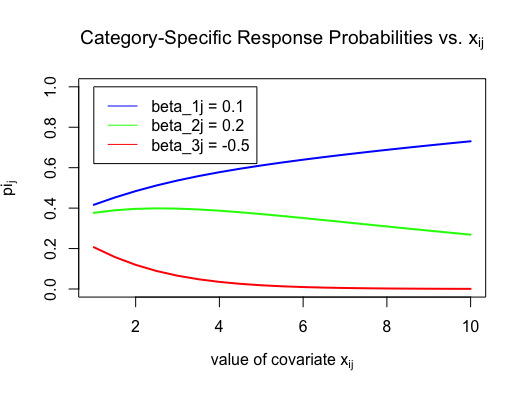
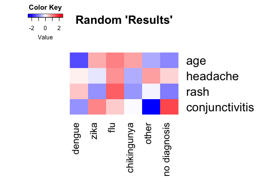

```{r setup, include=FALSE}
knitr::opts_chunk$set(echo = FALSE)
```

## Overview: Models for Multinomial Responses

Note: This lecture focuses mainly on the Baseline Category Logit Model (see Agresti Ch. 8), but for the exam we are responsible for reading Chapter 8 of the text and being familiar with all types of models for multinomial responses introduced there. 

\begin{itemize}
\item GLMs for Nominal Responses
\begin{itemize}
\tiny
\item Baseline Category Logit Model (Multinomial Logit Model)
\item Multinomial Probit Model
\end{itemize}
\item GLMs for Ordinal Responses
\begin{itemize}
\tiny
\item Cumulative Logit Model
\item Cumulative Link Models
\begin{itemize}
\tiny
\item Cumulative Probit Model
\item Cumulative Log-Log Model
\item Adjacent-Categories Logit Models
\item Continuation-Ratio Logit Models
\end{itemize}
\end{itemize}
\item Discrete-Choice Models
\begin{itemize}
\tiny
\item Conditional Logit Models (and relationship to Multinomial Logit Model)
\item Multinomial Probit Discrete-Choice Models 
\item Extension to Nested Logit and Mixed Logit Models
\item Extension to Discrete Choice Model with Ordered Categories 
\end{itemize}
\end{itemize}

## Baseline Category Logit Model

The Baseline Category Logit (BCL) model is appropriate for modeling nominal response data as a function of one or more categorical or quantitative covariates.

\begin{itemize}
\item Example: Modeling choice of voter candidate as a function of voter age (quantitative), gender (categorical nominal), race (categorical nominal), and socioeconomic status (categorical ordinal). 

\item Example: Modeling transcription factor binding to a promoter region as a function of transcription factor abundance (quantitative), affinity for the binding site (quantitative), and primary immune response activation status (categorical binary). 

\item Non-Example: Modeling consumer choice of soda size as a function of air temperature (quantitative) and time of day (quantitative).  Soda size is a categorical ordinal variable, so although this model will technically work, it does not incorporate all of the information that our data contain.
\end{itemize}

## BCL Model Formulation

Consider the set of $J$ possible values of a categorical response variable $\{C_1, C_2, \dots, C_J\}$ and the vector of $P$ covariates $\vec{X} = (X_1, X_2, \dots, X_P)$

**Goal:** For a particular vector of covariates $\vec{x_i} = (x_{i1}, x_{i2}, \dots, x_{iP})$, predict $Y_i$, the category to which the observation with covariates $\vec{x_i}$ belongs. (Note that $Y_i \in \{C_1, \dots, C_J\}$.)

**Intermediate Goal:** For all $j \in {1,\dots, J}$, use training data to fit  $\pi_j(\vec{x_i}) = P(Y_i = C_J | \vec{x_i})$ under the constraint that $\sum_{j=1}^J\pi_j(\vec{x_i}) = 1$ 

Conditional on the observed covariates and the estimates for the functions $\pi_j$, $Y_i$ is Multinomial: 
$$
Y_i | \vec{x_i} \sim Multinomial(1, \{\pi_1(\vec{x_i}), \dots, \pi_J(\vec{x_i})\})
$$


## Overview of Modeling Process
\small
\begin{itemize}
\item Choose one of the $J$ categories as a baseline. Without loss of generality, use $C_J$ (since the $C_j$ are nominal and ordering is irrelevant). 
\item Let $\mathbf{\beta_j} = (\beta_{j1}, \dots, \beta_{jP})$ be the category-specific coefficients of the covariates $\vec{x_i}$ for a particular category $C_J$. (note the dimensions of $\beta_j$ are $P$ x $1$)
\item Recall $\vec{x_i} = (x_{i1}, x_{i2}, \dots, x_{iP})$ is $P$ x $1$
\item We now can calculate the following scalar quantity, which is a log probability ratio that is modeled as a linear function of the covariates $\vec{x_i}$:
$$
\log\left(\frac{\pi_j(\vec{x_i})}{\pi_J(\vec{x_i})}\right) = \alpha_j + \pmb{\beta_j}^T\vec{x_i}
$$
\end{itemize}

## Overview of Modeling Process, continued

\begin{itemize}\setlength\itemsep{1cm}
\item Specifying the probabilities $\pi_j$ relative to the reference category $\pi_J$ specifies a similar log probability ratio for any two categories $\pi_a, \pi_b, a\neq b$, since

$$
\log\left(\frac{\pi_a(\vec{x_i})}{\pi_J(\vec{x_i})}\right) - \log\left(\frac{\pi_b(\vec{x_i})}{\pi_J(\vec{x_i})}\right) = \log\left(\frac{\pi_a(\vec{x_i})}{\pi_b(\vec{x_i})}\right)
$$
\item Note that we only need to model $(J-1)$ of the probabilities $\pi_j$, since the constraint $\sum_{j=1}^J\pi_j(\vec{x_i}) = 1$ uniquely constrains the $J^{th}$ conditional on the $(J-1)$.
\end{itemize}

## Formulation of the BCL Model as a Multivariate GLM 

**Response Vector** $$\vec{y_i} = (y_{i1}, y_{i2}, \dots, y_{i(J-1)})$$ 

**Expected Response Vector** $$E\left[\vec{y_i}\right] = g\left(\vec{\mu_{i}}\right)$$

**Argument to Link Function**
$$\begin{aligned}
\vec{\mu_i} \quad= (\mu_{i1}, \mu_{i2}, \dots, \mu_{i(J-1)})\\
          &= (\pi_1(\vec{x_i}), \pi_2(\vec{x_i}), \dots, \pi_{J-1}(\vec{x_i})) \\
\end{aligned}
$$

**Link Function**
$$
g\left(\vec{\mu_{i}}\right) = \left(\log\frac{\pi_1(\vec{x_i})}{\pi_J(\vec{x_i})}, \log\frac{\pi_2(\vec{x_i})}{\pi_J(\vec{x_i})}, \dots, \log\frac{\pi_{(J-1)}(\vec{x_i})}{\pi_J(\vec{x_i})}\right)^T= \mathbf{X_i}\pmb{\beta}
$$
where $\mathbf{X_i}$ and $\pmb{\beta}$ are defined on the next slide

## Formulation of the BCL Model as a Multivariate GLM 

**Matrix of Covariates**

$\mathbf{X_i}$ is a $(J-1)$ x $P(J-1)$ matrix (recall that $P$ is the number of covariates) constructed from blocks of the form $(1, x_{i1}, x_{i2}, \dots, x_{i(P-1)})$

$$
\mathbf{X_i} = \begin{pmatrix}
&\:\color{orange}{1}\quad\color{orange}{x_{i1}}\quad\color{orange}{\dots}\quad\color{orange}{x_{iP}}\color{black}{\:\:\:0\quad0\quad\dots\quad0\quad\dots\quad0\quad\dots\quad0\quad}& \\
&0\:\:\:0 \quad\: \dots \quad \:\:\: 0 \quad\color{orange}{1} \quad \color{orange}{x_{i1}} \quad \color{orange}{\dots} \:\:\: \color{orange}{x_{iP}} \color{black}{\:\:\dots\quad0 \quad \dots \quad 0\:\:\:}& \\
&\:\vdots \quad \vdots \quad \vdots \quad \vdots \quad \vdots \quad \vdots \quad \vdots \quad \vdots \quad \vdots \quad \vdots \quad \vdots\quad \vdots \quad \vdots \quad \vdots \quad \vdots \quad \vdots \quad \color{white}{\vdots} \quad \vdots \quad& \\
&\:0\:\:\:0\:\:\:\dots\quad0 \quad 0 \quad 0 \quad \dots \quad 0 \quad \dots \quad \color{orange}{1} \:\:\: \color{orange}{x_{i1}} \quad .. \quad \color{orange}{x_{ip}}\quad \:& \\
\end{pmatrix}
$$

<!-- $$ -->
<!-- \mathbf{X_i} = \begin{pmatrix} -->
<!-- \color{orange}{1} & \color{orange}{x_{i1}}  & \color{orange}{\dots} & \color{orange}{x_{iP}} & 0 & 0 & 0 & 0 & \dots & 0\\ -->
<!-- 0 & 0 & \dots & 0 & \color{orange}{1} & \color{orange}{x_{i1}} & \color{orange}{\dots} & \color{orange}{x_{iP}} & \dots & 0\\ -->
<!-- \vdots & \vdots & \vdots & \vdots & \vdots & \vdots & \vdots & \vdots & \vdots & \vdots\\ -->
<!-- 0 & 0 & 0 & 0 & \dots & 0 & \color{orange}{1} & \color{orange}{x_{i1}} & \dots & \color{orange}{x_{ip}}\\ -->
<!-- \end{pmatrix} -->
<!-- $$ -->

**Vector of Parameters** 

$\pmb{\beta}$ is a column vector with dimension $(J-1)P$ x $1$, containing the category-specific coefficients $\alpha_j$ and $\beta_{jk}$ for $j \in \{1, J-1\}$ and $k \in \{1,P\}$:
$$\pmb{\beta} = (\color{blue}{\alpha_1, \beta_{11}, \dots, \beta_{1P}}, \color{red}{\alpha_2, \beta_{21}, \dots, \beta_{2P}}, \dots, \color{green}{\alpha_{J-1}, \beta_{(J-1)1}}\color{black}{,\dots,} \color{green}{\beta_{(J-1)P}}\color{black})^T$$


## Multivariate GLM : The Mechanics of Prediction

\begin{itemize}\setlength\itemsep{1cm}
\item $\mathbf{X_i}$ is $J-1$ x $P(J-1)$ and $\pmb{\beta}$ is $P(J-1)$ x $1$
\item $\vec{y_{i}} = g(\vec{\mu_i})  = \mathbf{X_i}\pmb{\beta}$ is a $J-1$ x $1$ column vector
\end{itemize}

Let $\mathbf{X_{i}^{(j)}}$ refer to the $j^{th}$ row vector of $\mathbf{X_i}$. Then the dot product of $\mathbf{X_{i}^{(j)}}$ with the parameter vector $\pmb{\beta}$ is the predicted log probability ratio for observation $i$ and non-reference category $C_j$:

$$y_{ij} = g(\vec{\mu_i})= \log\left(\frac{\pi_j(\vec{x_i})}{\pi_J(\vec{x_i})}\right) = \mathbf{X_{i}^{(j)}} \cdot \pmb{\beta}$$ 

## Multivariate GLM : Example of the Mechanics of Prediction
\small{Suppose we wish to calculate $y_{i1}$.}

The first row vector of $\mathbf{X_i}$ is:
$$\mathbf{X_{i}^{(1)}} = (\color{orange}{1,x_{i1},x_{i2}, \dots,x_{iP}}\color{black}{,0,0,0, \dots,0)}$$
The column vector of parameters $\beta$ is the same for all $i$:
$$\pmb{\beta} = (\color{blue}{\alpha_1, \beta_{11}, \dots, \beta_{1P}}, \color{red}{\alpha_2, \beta_{21}, \dots, \beta_{2P}}\color{black}{,\dots,} \color{green}{\alpha_{J-1}, \beta_{(J-1)1},\dots, \beta_{(J-1)P}}\color{black})$$
Their dot product gives us the predicted $y_{i1}$:
$$\begin{aligned}
y_{i1} =& g(\pi_1(\vec{x_i}))  = \log\left(\frac{\pi_1(\vec{x_i})}{\pi_J(\vec{x_i})}\right)\\
=& \mathbf{X_{i}^{(1)}} \cdot\pmb{\beta} \\
=& \color{orange}1\color{blue}{\alpha_1} + \color{orange}{x_{i1}}\color{blue}{\beta_{11}} + \dots + \color{orange}{x_{iP}}\color{blue}{\beta_{1P}} \\
&+ 0*\color{red}{\alpha_2} \color{black}{ + 0*}\color{red}{\beta_{21}} \color{black}{+ \dots + {0*}}\color{red}{\beta_{2p}} \\
&+ \dots \\
&+ \color{black}{0*}\color{green}{\alpha_{J-1}} \color{black}{+0*}\color{green}{\beta_{(J-1)1}}\color{black}{ + \dots + 0*}\color{green}{\beta_{(J-1)p}} \\
=& \color{orange}1\color{blue}{\alpha_1} + \color{orange}{x_{i1}}\color{blue}{\beta_{11}} + \dots + \color{orange}{x_{iP}}\color{blue}{\beta_{1P}} \\
\end{aligned}
$$

## Response Probabilities

Note the following relationship:

$$ 
\log\left(\frac{\pi_j(\vec{x_i})}{\pi_J(\vec{x_i})}\right) = \mathbf{X_i}\pmb{\beta} \implies \pi_j(\vec{x_i}) = \frac{\exp(\mathbf{X_i}\pmb{\beta_j})}{1 + \sum_{n=1}^{j-1}\exp(\mathbf{X_i}\pmb{\beta_n})}
$$

The argument of the log function here is sometimes referred to as the "relative risk" in the public health setting.

## Response Probabilities

&nbsp;
&nbsp;

\tiny
Plotting the $\pi_j(\vec{x_i})$ as a function of one covariate $x_{ij}$ can provide a nice graphic of how these probabilities compare to one another when projected onto $x_{ij} \times \pi_j$ (i.e., compare the category-specific response probabilities for different values of the $j^{th}$ covariate for subject $i$ with all other covariates held constant).


## Using $\chi^2$ or $G^2$ as a Model Check

When all predictors in a model are categorical and the training data can be represented in a contingency table that is not sparse, the $chi^2$ or $G^2$ goodness-of-fit tests used earlier in the semester can be used to assess whether or not the fitted BCL model is appropriate. (generate "expected" contingency table from predicted results and then "residuals" are expected-observed)

If some predictors are not categorical or the contingency table is sparse, these statistics are "valid only for comparing nested models differing by relatively few terms" (A. Agresti, Categorical Data Analysis p. 294).  This means that they cannot validly be used as a model check overall, but they can be used to compare fit of full vs. reduced models if the full model only has "relatively few" more covariates than the reduced one(s).  

## Example: Using Symptoms to Classify Disease (Reich Lab Research)
&nbsp;
\begingroup
\small
\textbf{Motivating Question: Confirmatory clinical tests are expensive and take time, meaning they are not a reasonable diagnostic option in many public health settings.  Can we instead design a model that can use routine observable symptoms to classify sick individuals accurately? (Adapted from work in progress by Brown et. al. )}
\endgroup

&nbsp;

\small
\begincols
\begincol{.48\textwidth}
Categories: 

\begin{itemize}
\item $C_1$: Dengue 
\item $C_2$: Zika
\item $C_3$: Flu
\item $C_4$: Chikingunya
\item $C_5$: Other
\item $C_6$: No Diagnosis
\end{itemize}
\endcol

\begincol{.48\textwidth}
Covariates (a few of many in the actual model):

\begin{itemize}
\item Age
\item Headache
\item Rash
\item Conjunctivitis
\item ...
\end{itemize}
\endcol
\endcols

## Using Symptoms to Classify Disease, Continued

Assume that each individual can only have one disease at once, and let $y_{i}$ be a binary vector representing the gold-standard diagnosis of the $i^{th}$ individual in the training set. For example, using the ordering on the previous slide, the observation
$$
y_1 = (0,0,1,0,0,0)
$$
means that individual 1 was diagnosed with the flu using gold-standard methods. 

The proposed model chooses the category $C_6:$ No Diagnosis as the baseline category, estimates the $\pi_j$ based on the training data $\{(y_i, \vec{x_i})\}$ and finds the set of parameters $\pmb\beta$ such that 

$$
\log\left(\frac{\pi_j(\vec{x_i})}{\pi_6(\vec{x_i})}\right) = \mathbf{X_i}\pmb\beta
$$


## Using Symptoms to Classify Disease: Visualization Method

\small{We might use a graphic like the one below to represent resulting estimates for $\pmb\beta$ (these results are just randomly generated from a standard normal distribution):}


## Using Symptoms to Classify Disease: Interpretation of Graphic

\small
Here are a few interpretations of what this model's coefficients would mean from our classmates, taken with author permission from the course discussion page on Piazza.

\scriptsize
&nbsp;
"A dark blue rectangle means that your probability of being diagnosed with that particular disease (given the presence of that covariate) is lower than the probability that you will have the negative diagnosis (given the presence of that covariate). In particular, the ratio of the probabilities is $e^{\beta}$, which in the 'dark blue case' could be something like $e^{-1}$. If it were that particular value, that means that P(that_disease) / P(neg_diagnosis) would be about .36 - that is, your probability of the diagnosis is about 1/3 of the probability of the baseline." - Yukun Li and Josh Nugent

&nbsp;
"Holding all else constant, given you have a covariate, the risk ratio of having a disease versus a negative test is $e^\beta$." - Bianca Doone

&nbsp;
"If $X$ is a binary category variable (group1: $X = 1$, group2: $X =0$): Holding other variable constant,  the risk ratio of having a $j^{th}$ disease versus a negative test in group 1 is $e^\beta$ times the risk ratio in group 2. If $X$ is a contiuous variable: Holding other variable constant, with one unit increase in $X$, the risk ratio of having a $j^{th}$ disease versus a negative test is multiply by $e^\beta$." - Guandong (Elliot) Yang

## Supplementary - Utility Functions and Probit Models

In a setting where the response variable is categorical and represents an individual's choice as a function of certain covariates, we can define a utility function that takes on values $U_1, \dots, U_J$ for each of $C_1, \dots, C_j$ categories.  The "voter choice" example from earlier in these notes represents such a setting.

Models based on utility functions assume that the individual will make the choice of maximum utility, i.e., choose the category $j*$ such that  $U_{j*} = \max_j\{U_j\}$.

Utility is typically different for each individual, so a more detailed formulation defines $\mathbf{U_i} = (U_{i1}, \dots, U_{iJ})$ for each individual $i$, and predicts response $j_i^*$ such that $U_{ij*} = \max_j\{U_{ij}\}$.

## Supplementary - Utility Functions and Probit Models (Agresti p.299) 

If a utility function is used as the link function in the multivariate GLM, we get an equation of the form:

$$
U_{ij} = \alpha_j +\pmb{\beta}_j^T\left(\vec{x_i}\right) + \epsilon_{ij}
$$

Under the assumption that the distribution of the $\epsilon_{ij}$ are i.i.d. with the extreme value distribution, McFadden (1974) showed that this model is equivalent to the BCL model. In this setting, the interpretation of $\beta_j$ is the expected change in $U_ij$ with a change of one unit in covariate $x_{ij}$, all other covariates held constant. 

Recall that the extreme value distribution has CDF:

$$
F_X(x) = exp(-exp(-x))
$$
What if the $\epsilon_{ij}$ are not assumed to have this distribution? 

## Supplementary - Utility Functions and Probit Models (Agresti p.299) 

If we instead assume $\epsilon_{ij}$ are i.i.d. with the standard Normal distribution, the resulting model 

$$
U_{ij} = \alpha_j +\pmb{\beta}_j^T\left(\vec{x_i}\right) + \epsilon_{ij}
$$

is the \textbf{multinomial probit model}.  In this setting, the interpretation of $\beta_j$ is also the expected change in $U_ij$ with a change of one unit in covariate $x_{ij}$, all other covariates held constant, but the link $U_{ij}$ is the probit function rather than the logit function. 

## Why Probit over Logit? 

\begingroup
\small
Implicit in the  multinomial logit model is dependence on the \textbf{Independence of Irrelevant Alternatives (IIA)} axiom.  

Framed in the language of utility functions, the IIA axiom says:
\endgroup

\begin{itemize}
\item If $C = \{C_1, C_2\}$ represents the categorical outcome set with utilities $U_i = \{U_{i1}, U_{i2}\}$ such that $U_{i1} > U_{i2}$, , then adding a third option $C_3$ to the outcome set will not change this ordering.
\end{itemize}

\small
The multinomial probit model does not depend on the IIA axiom, and is therefore an interesting approach for many applications, including voting theory.

\small
\textbf{Example:} In the 2016 election, if the only two candidates in the mix were Hillary Clinton and Jill Stein, a voter might have chosen Jill Stein knowing that Hillary was likely to win anyways but that a vote for Jill represented their beliefs.  However, introducing Donald Trump into the mix might have convinced that voter that they should choose Hillary instead of Jill, since a third-party vote for Jill would draw from Hillary's chance. Thus the IIA axiom is violated. The multinomial probit model can model this setting.

## Example: Alvarez and Katz (2007) Multinomial Probit Model for Election Choice in Chile in 2005

Alvarez and Katz study the 2005 election in Chile, in which candidates came from three main coalitions with four main candidates:

\begin{itemize}\setlength\itemsep{1cm}
\small
\item Left coalition (Tomas Hirsch Goldschmidt)
\item Center-left Concertacion coalition (Michelle Bachelet Jeria)
\item Conservative Alianza por Chile coalition (Independent Democratic Union - Joaquin Lavin Infante, National Renewal Party - Sebastian Pinera Echenique)
\end{itemize}

## Example: Alvarez and Katz (2007) Multinomial Probit Model for Election Choice in Chile in 2005

\begingroup
\small
None of the four candidates won a majority in the first vote, so Chile held a run-off election and eventually elected Michelle Bachelet Jeria, who had the highest proportion of votes in the original election.  
\endgroup

&nbsp;

"We ... find that the presence of a second conservative candidate significantly affected citizens’ electoral behavior, increasing the support for the right and influencing the electoral outcome in a way that cannot be accounted for by analyses focused exclusively on citizens’ party identification." 

&nbsp;

\small
R. Michael Alvarez and Gabriel Katz, 2007. \textit{A Bayesian Multinomial Probit Analysis of Voter Choice in Chile's 2005 Presidential Election} Social Science Working Paper 1287, California Institute of Technology, Division of the Humanities and Social Sciences. 

[Election Results] https://en.wikipedia.org/wiki/Chilean_presidential_election,_2005%E2%80%9306
